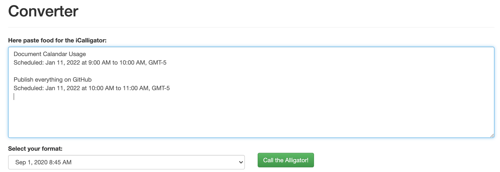
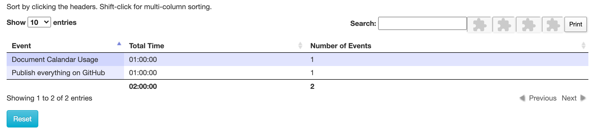

# iCal Breakdowner

## About

[Original version](https://github.com/frnhr/ical_aggregator) (was not able to correctly parse anything with that, but the codebase was useful)

## Changelog

 * Removed google-analytics call
 * Tidied up UI
   * Removed banners, commercials, confusing text
   * Removed not-working date formats
   * Added instructions

## Usage

 * Open [the Aggregator webpage](index.html)
 * Open Mac OS Calendar app.
 * Make sure only the calendar you are interested in is selected.
 * Switch to monthly view, hit CMD+A, CMD+C
 * Paste into fields below, hit the green button  
  
 > Make sure the pasted format looks like this: ```Scheduled: Jan 29, 2021 at 09:30 AM to 10:00 AM```. Disable the 24h in mac os settings if needed. Time Zones can be ignored, they are automatically removed.
 * Click print, export as PDF  


## Origins / Pull Requests

 * Original Code: [GitHub, frnhr](https://github.com/frnhr/ical_aggregator)
 * Changes / Fixes: Maximilian Schiedermeier 
   * Github: Kartoffelquadrat
   * Webpage: https://www.cs.mcgill.ca/~mschie3

